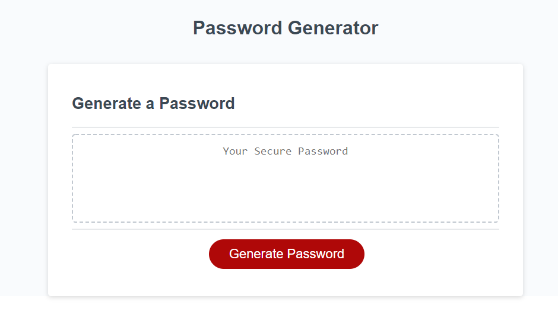

# Password Generator

The main purpose of this project is to create a "password generator tool" that can generate passwords randomly based on users' criteria.

## Task List

- [x] Make CSS clean and responsive
- [x] Dynamically change HTML and CSS using JavaScript
- [x] Enable users to select password criteria
- [x] Enable users to select password length
- [x] Password length should be at least 8 characters and no more than 128 characters
- [x] At least one criteria should be selected by user to proceed
- [x] Generated password should be displayed on the screen

## Tech/framework used
* HTML
* CSS
* JavaScript

## User Story

As an employee with access to sensitive data, I want to randomly generate a password that meets certain criteria, so that I can create a strong password that provides greater security.

## Acceptance Criteria

* When I click the button to generate a password, then I am presented with a series of prompts for password criteria
* When prompted for password criteria, then I select which criteria to include in the password
* When prompted for the length of the password, then I choose a length of at least 8 characters and no more than 128 characters
* When prompted for character types to include in the password, then I choose lowercase, uppercase, numeric, and/or special characters
* When I answer each prompt, then my input should be validated and at least one character type should be selected
* When all prompts are answered, then a password is generated that matches the selected criteria
* When the password is generated, then the password is either displayed in an alert or written to the page

## Link to Deployed Application
https://sshahram.github.io/password-generator/

## Link to Github Repository
https://github.com/sshahram/password-generator

## Screenshot
Here is the snapshot of the website:

